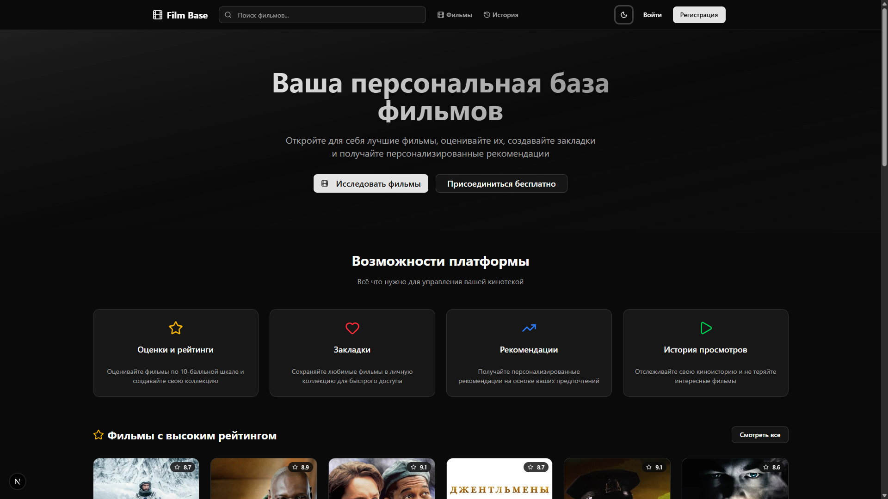
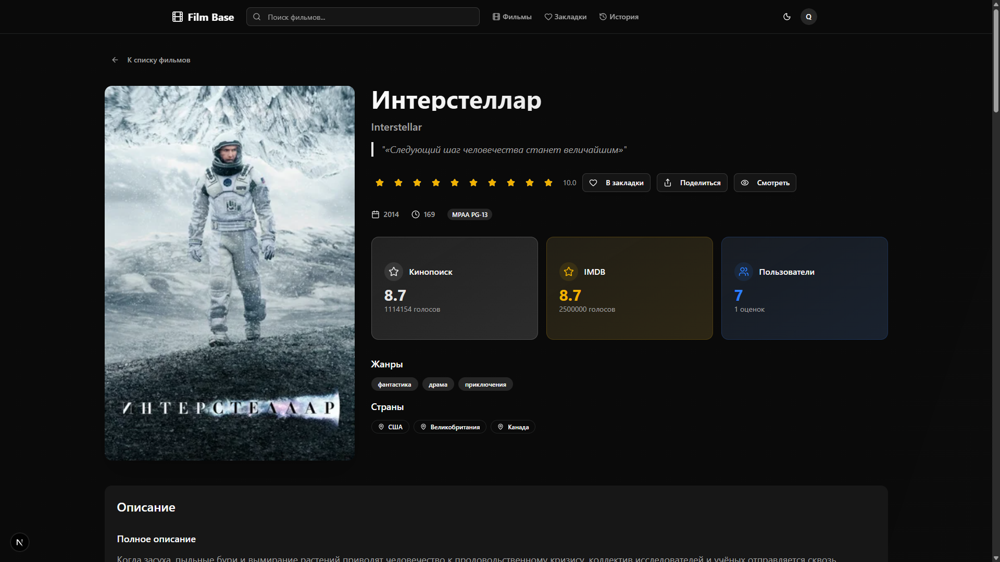
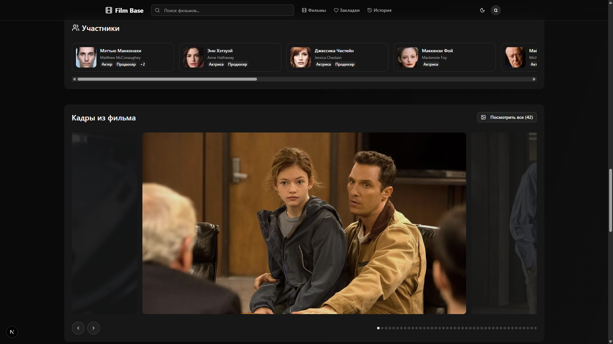
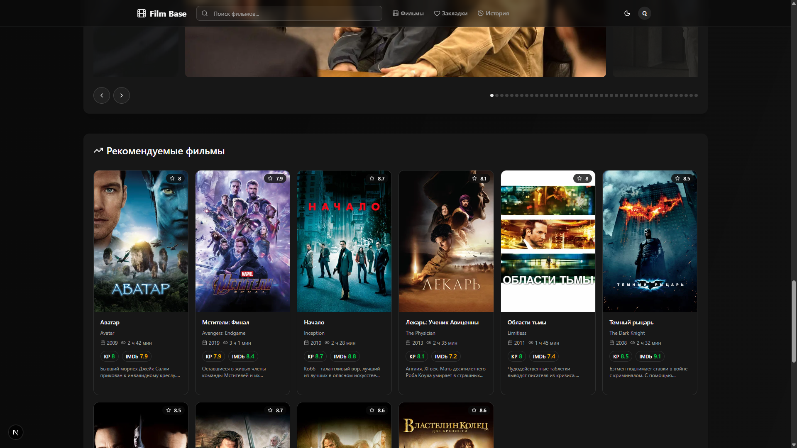
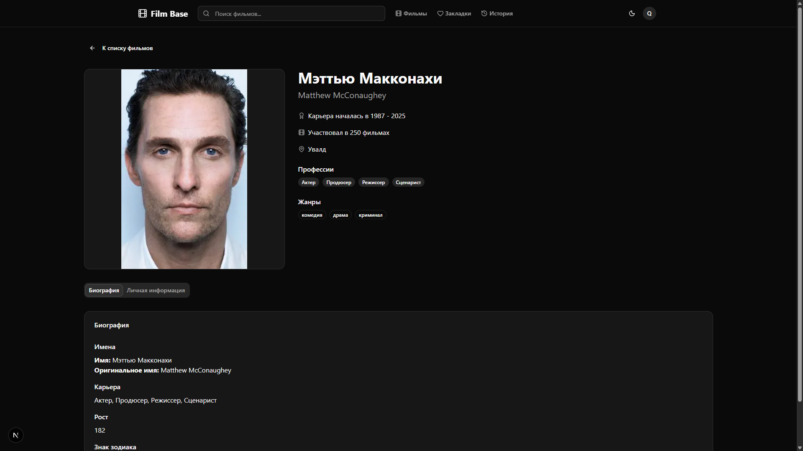
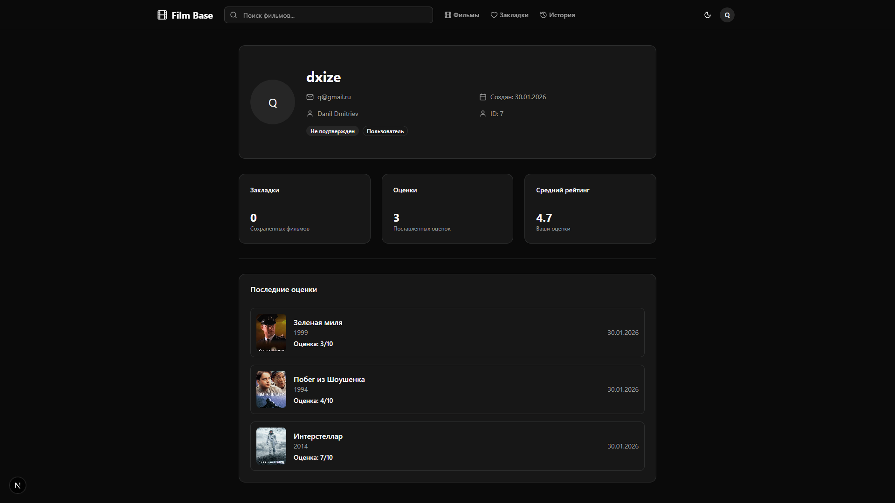
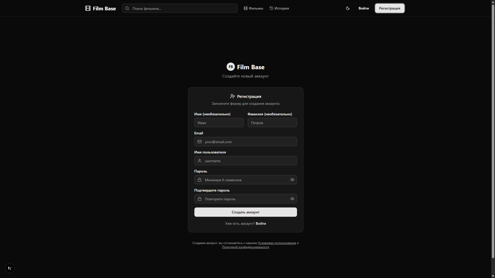

# Film Base Kinopoisk

## Кратко о проекте

Film Base Kinopoisk — сервис для просмотра фильмов с встроенным плеером и собственной базой данных, похожей на Кинопоиск.  
Вот сам сайт, можно посмотреть: https://filmbasekinopoisk.vercel.app/ 
(ветка `stable_version`).

## Из каких частей состоит проект

- `parser/` — парсер Кинопоиска, заполняет PostgreSQL фильмами, участниками, похожими фильмами и кадрами.
- `backend/` — API на FastAPI: авторизация, фильмы, участники, закладки, комментарии, оценки, админка.
- `frontend/` — интерфейс на Next.js, который ходит в backend API.

## Какие технологии и как это работает

### Парсер (`parser/`)

- **Технологии**: Python, requests, BeautifulSoup/lxml, PostgreSQL‑драйвер.
- **Как работает**: обходит страницы Кинопоиска (в т.ч. топ‑250), парсит детали фильма, участников, похожие фильмы и кадры, затем сохраняет всё в PostgreSQL.

### Бэкенд (`backend/`)

- **Технологии**: Python, FastAPI, SQLAlchemy, Alembic, PostgreSQL, Docker Compose.
- **Как работает**: поднимает REST API поверх данных в PostgreSQL, обрабатывает авторизацию, работу с фильмами/участниками/закладками/комментариями/оценками и отдаёт данные фронтенду.

### Фронтенд (`frontend/`)

- **Технологии**: Next.js, React, TypeScript, Tailwind и др. UI‑библиотеки.
- **Как работает**: рендерит страницы каталога, карточки фильма, профиля, закладок, истории и админки, отправляет запросы к FastAPI‑бэкенду и отображает результаты, в том числе встроенный плеер.

## Почему первый запуск может быть медленным

Бэкенд крутится на бесплатном тарифе Render, который «усыпляет» сервис примерно через 15 минут простоя. Первый запрос после простоя может долго открываться — просто подождите и при необходимости обновите страницу.

## Скриншоты

### Главный экран

### Страница фильма

### Страница актера

### Страница профиля пользователя

### Страница регистрации

